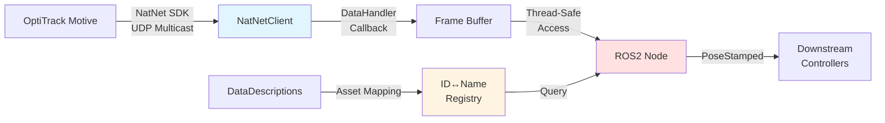

# OptiTrack Motive ROS2 Streamer Node

[中文版](./README_zh.md)

## Overview

`motive_streamer` is a ROS2 node that interfaces with OptiTrack Motive motion capture system via the NatNet SDK. It provides real-time 6DoF (6 Degrees of Freedom) pose data of rigid bodies for robotics applications requiring high-precision feedback, such as autonomous navigation, manipulation, and vision-servo control.

**Key Features:**
- **Real-time streaming**: Asynchronous data acquisition via NatNet SDK callbacks
- **Dynamic asset mapping**: Automatic rigid body ID ↔ Name resolution from DataDescriptions
- **Multi-threaded callback**: Static callback bridging to ROS2 publisher
- **Network configuration**: Supports multicast UDP streaming
- **Standard ROS2 interface**: Publishes `geometry_msgs/PoseStamped` for seamless integration

---

## Technical Stack

| Component | Version/Standard |
|-----------|------------------|
| **Language** | C++17 |
| **ROS2 Distribution** | Humble Hawksbill |
| **NatNet SDK** | 4.x (included) |
| **Build System** | CMake 3.20+ |
| **Communication Protocol** | UDP Multicast (default: 239.255.42.99) |
| **Message Interface** | geometry_msgs, std_msgs |

---

## System Architecture

### Data Flow Diagram



### Module Breakdown

```
MotiveStreamer Node
├── NatNetClient (SDK Layer)
│   ├── Connection Management (ConnectClient)
│   ├── Data Callback (DataHandler)
│   └── Message Logging (MessageHandler)
├── Data Mapping (UpdateDataDescriptions)
│   ├── assetIDtoAssetName (ID → Name)
│   ├── assetNameToAssetID (Name → ID)
│   └── assetIDtoAssetDescOrder (ID → Index)
└── ROS2 Publisher
    └── PoseStamped @ /{namespace}/{pose_pub_topic}
```

---

## Key Challenges & Solutions

### 1. **Asynchronous Callback → Synchronous Publishing**

**Challenge**: NatNet SDK uses a C-style callback (`DataHandler`) triggered by network thread, while ROS2 expects synchronous publishing in the main thread context.

**Solution**:
- Static callback function with `void* pUserData` to pass `MotiveStreamer` instance
- Direct publishing inside callback (acceptable for single rigid body case)
- Timestamp assigned using `rclcpp::Clock().now()` to maintain temporal consistency

```cpp
// Thread-safe callback bridging
void NATNET_CALLCONV MotiveStreamer::DataHandler(sFrameOfMocapData* data, void* pUserData) {
    MotiveStreamer* pStreamer = (MotiveStreamer*)pUserData;
    // ... extract pose data ...
    pStreamer->pubRigidPose->publish(poseStampedMsg);
}
```

**Trade-offs**:
- ✅ Zero-copy: Publish immediately without buffering
- ⚠️ Blocking risk: If ROS2 publish blocks, may affect NatNet thread
- 🔧 Future improvement: Use lock-free queue for multi-rigid-body scenarios

---

### 2. **Dynamic ID ↔ Name Mapping**

**Challenge**: OptiTrack assigns numeric IDs to rigid bodies, but users refer to them by name (e.g., "uav1"). The mapping is dynamic and retrieved from `DataDescriptions` at runtime.

**Solution**:
- On initialization, call `GetDataDescriptionList()` to retrieve all assets
- Parse `sDataDescriptions` structure to build bidirectional maps:
  - `assetNameToAssetID`: For launch parameter → internal ID lookup
  - `assetIDtoAssetName`: For logging and debugging
- Support multiple asset types (RigidBody, Skeleton, ForcePlate, Device, Asset)

```cpp
void MotiveStreamer::UpdateDataToDescriptionMaps(sDataDescriptions* pDataDefs) {
    for (int i = 0; i < pDataDefs->nDataDescriptions; i++) {
        switch (pDataDefs->arrDataDescriptions[i].type) {
            case Descriptor_RigidBody:
                assetID = pRB->ID;
                assetName = std::string(pRB->szName);
                // ... insert into maps ...
        }
    }
}
```

**Failure Mode**: If rigid body name doesn't exist in Motive scene, throws exception at startup:
```
RCLCPP_ERROR: No rigid body named uav1
```

---

### 3. **Network Interruption Handling**

**Challenge**: OptiTrack system may restart, network may drop, or Motive application may reload scene.

**Current Implementation**:
- `ConnectClient()` calls `Disconnect()` before `Connect()` for clean reconnection
- No automatic retry loop (requires manual node restart)

**Recommended Enhancement** (not yet implemented):
```cpp
// Add to constructor or timer callback
timer_ = create_wall_timer(5s, [this]() {
    if (!natnetClient->IsConnected()) {
        RCLCPP_WARN(get_logger(), "Connection lost, attempting reconnect...");
        ConnectClient();
        UpdateDataDescriptions();
    }
});
```

---

### 4. **Multi-threading Data Race**

**Observed Issue**: `DataHandler` runs in NatNet's network thread, while ROS2 publisher may be accessed from main thread during shutdown.

**Current Mitigation**:
- Single publisher instance reduces race surface
- Destructor calls `Disconnect()` before deleting `natnetClient`

**Potential Risk**:
- If multiple rigid bodies are tracked and stored in shared containers, need explicit mutex:
```cpp
std::mutex data_mutex_;
std::lock_guard<std::mutex> lock(data_mutex_);  // In callback
```

---

### 5. **Frame ID Configuration**

**Current Implementation**: The frame ID is hardcoded to "base_link" in the callback:

```cpp
poseStampedMsg.header.frame_id = "base_link";
```

**Limitation**: This should be parameterized to allow flexible coordinate frame assignment for different robot configurations.

**Recommended Enhancement**:
```cpp
// Add in constructor
declare_parameter("frame_id", "optitrack_frame");
frame_id_ = get_parameter("frame_id").as_string();

// Use in callback
poseStampedMsg.header.frame_id = pStreamer->frame_id_;
```

---

## Performance Considerations

### Timing Measurement

The code includes timing instrumentation in the `DataHandler` callback:

```cpp
std::chrono::steady_clock::time_point timepoint1 = std::chrono::steady_clock::now();
// ... processing ...
std::chrono::steady_clock::time_point timepoint2 = std::chrono::steady_clock::now();
std::chrono::duration<double> time_span = std::chrono::duration_cast<std::chrono::duration<double>>(timepoint2 - timepoint1);
RCLCPP_INFO(pStreamer->get_logger(), "time_span: %f", time_span.count());
```

This measures the processing time from data reception to ROS2 publication.

### Network Protocol

- **Connection Type**: UDP Multicast (configured in code)
- **Default Multicast Address**: `239.255.42.99` (IANA local network range)
- **Default Ports**: Command=1510, Data=1511 (NatNet SDK standard)
- **Maximum Packet Size**: 65503 bytes (IP/UDP overhead accounted for)

---

## Installation

### Prerequisites

**Hardware**:
- OptiTrack motion capture system (Prime/Flex/Slim series)
- Dedicated Gigabit Ethernet NIC (recommended)
- x86_64 Linux system

**Software**:
- Ubuntu 22.04 LTS
- ROS2 Humble (desktop-full installation)
- CMake ≥ 3.20
- GCC ≥ 9.0 (C++17 support)

### Build Steps

1. **Clone repository into ROS2 workspace**:
```bash
mkdir -p ~/ros2_ws/src
cd ~/ros2_ws/src
git clone <repository_url> motive_streamer
```

2. **Install ROS2 dependencies**:
```bash
cd ~/ros2_ws
rosdep install --from-paths src --ignore-src -r -y
```

3. **Build package**:
```bash
colcon build --packages-select motive_streamer --cmake-args -DCMAKE_BUILD_TYPE=Release
source install/setup.bash
```

4. **Verify NatNet library**:
```bash
ldd install/motive_streamer/lib/motive_streamer/motive_streamer_node | grep NatNet
# Expected output: libNatNet.so => <workspace>/install/lib/libNatNet.so
```

---

## Configuration & Usage

### Network Setup

**1. Check OptiTrack Network Settings** (in Motive):
- View → Data Streaming Pane
- Enable "Broadcast Frame Data"
- Note "Local Interface" IP (e.g., 192.168.50.203)
- Default ports: Command=1510, Data=1511

**2. Configure Linux Host Network**:
```bash
# Set static IP in same subnet as OptiTrack server
sudo ip addr add 192.168.50.208/24 dev eth0

# Enable multicast routing (if using multicast mode)
sudo ip route add 224.0.0.0/4 dev eth0

# Test connectivity
ping 192.168.50.203
```

**3. Verify Multicast Reception** (optional):
```bash
# Install iperf3
sudo apt install iperf3

# Listen on multicast group (from another terminal)
iperf3 -s -B 239.255.42.99

# Check if packets are arriving with tcpdump
sudo tcpdump -i eth0 host 239.255.42.99
```

---

### Launch Parameters

| Parameter | Type | Default | Description |
|-----------|------|---------|-------------|
| `motive_topic_name` | string | `motive_rigid_body_list` | (Unused) Topic name for full rigid body list |
| `local_address` | string | `192.168.50.208` | Local machine IP address |
| `motive_address` | string | `192.168.50.203` | OptiTrack server IP address |
| `pose_pub_topic` | string | `vision_pose/pose` | ROS2 topic name for pose publishing |
| `rigid_name` | string | `uav1` | Rigid body name (as defined in Motive) |
| `namespace` | string | (same as `rigid_name`) | ROS2 namespace for topic isolation |

### Launch Command

**Single Rigid Body**:
```bash
ros2 launch motive_streamer motive_streamer.py \
    local_address:=192.168.50.208 \
    motive_address:=192.168.50.203 \
    rigid_name:=uav1 \
    pose_pub_topic:=vision_pose/pose
```

**Expected Output**:
```
[INFO] [motive_streamer]: NatNet SDK Version: 4.1.0.0
[INFO] [motive_streamer]: Client initialized and ready.
[INFO] [motive_streamer]: Client is connected to server and listening for data...
[INFO] [motive_streamer]: rigid_name: uav1, rigid_id: 1
[INFO] [motive_streamer]: time_span: 0.000152
```

**Verify Data Stream**:
```bash
# Check topic publication rate
ros2 topic hz /uav1/vision_pose/pose

# View live data
ros2 topic echo /uav1/vision_pose/pose

# Inspect message structure
ros2 interface show geometry_msgs/msg/PoseStamped
```

---

## Message Definitions

### Published Topics

| Topic | Type | Frequency | Description |
|-------|------|-----------|-------------|
| `/{namespace}/{pose_pub_topic}` | `geometry_msgs/PoseStamped` | 120 Hz | 6DoF pose of target rigid body |

### Custom Messages

**MotiveRigidBody.msg**:
```msg
int32 id          # Rigid body ID from Motive
bool valid        # Tracking state (false if occluded)
geometry_msgs/Pose pose  # 6DoF pose (position + quaternion orientation)
```

**MotiveRigidBodyList.msg**:
```msg
std_msgs/Header header
motive_streamer/MotiveRigidBody[] rigid_bodies
```

*(Note: `MotiveRigidBodyList` is defined but not currently published. Future enhancement for multi-body tracking.)*

---

## Failure Modes & Error Handling

### Common Errors

| Error | Cause | Resolution |
|-------|-------|------------|
| `Unable to connect to server. Error code: -1` | Network unreachable or wrong IP | Verify `motive_address`, check firewall, ping server |
| `No rigid body named <name>` | Rigid body doesn't exist in Motive scene | Check rigid body name in Motive, ensure it's marked as "Rigid Body" |
| `Unable to retrieve Data Descriptions` | Motive not streaming | Enable "Broadcast Frame Data" in Motive Data Streaming pane |
| `Connection lost mid-session` | Network cable unplugged or Motive crashed | Manual restart required (no auto-reconnect yet) |
| Silent data stream (no pose updates) | Wrong rigid body ID or tracking lost | Check `rigid_id` in logs, verify markers visible in Motive |

### Debugging Commands

```bash
# Check if node is running
ros2 node list | grep motive_streamer

# View all parameters
ros2 param list /motive_streamer

# Monitor callback execution time
ros2 topic echo /rosout | grep time_span

# Test network connectivity at OS level
sudo tcpdump -i eth0 udp port 1511 -c 10
```

---

## Code Structure

### Key Files

| File | Lines | Responsibility |
|------|-------|----------------|
| `include/motive_streamer/motive_streamer.hpp` | 54 | Class declaration, member variables |
| `src/motive_streamer.cpp` | 249 | Core logic: connection, mapping, callbacks |
| `src/motive_streamer_main.cpp` | 22 | Entry point with ROS2 initialization |
| `msg/MotiveRigidBody.msg` | 3 | Custom message for single rigid body |
| `msg/MotiveRigidBodyList.msg` | 2 | Custom message for multiple rigid bodies |
| `launch/motive_streamer.py` | 37 | Launch file with parameter declarations |
| `config/stream_rigid.yaml` | 5 | Default configuration parameters |
| `CMakeLists.txt` | 85 | Build configuration and NatNet linking |

### Critical Code Sections

**Connection Initialization** (`motive_streamer.cpp:134-144`):
```cpp
int MotiveStreamer::ConnectClient() {
    natnetClient->Disconnect();  // Clean disconnect before reconnect
    int ret = natnetClient->Connect(connectParams);
    if (ret != ErrorCode_OK) {
        RCLCPP_ERROR(get_logger(), "Unable to connect to server. Error code: %d", ret);
        return ErrorCode_Internal;
    }
    return ret;
}
```

**Data Descriptor Parsing** (`motive_streamer.cpp:161-248`):
- Handles 7 descriptor types: RigidBody, Skeleton, MarkerSet, ForcePlate, Device, Camera, Asset
- Builds three maps for bidirectional lookup and ordering
- Detects duplicate IDs and logs warnings

**Frame Callback** (`motive_streamer.cpp:80-110`):
- Includes timing instrumentation to measure processing time (logged on every frame)
- Iterates through all rigid bodies in frame to find target ID
- Publishes OptiTrack coordinate frame directly (Y-up, right-handed); coordinate conversion to ROS conventions can be handled downstream via TF

---

## Performance Optimization Notes

### Design Decisions

1. **Direct publish in callback**: The implementation publishes directly in `DataHandler` without intermediate buffering. This minimizes latency but couples the NatNet network thread with ROS2 publisher.

2. **Efficient data structures**: Uses `std::map` for ID↔Name resolution with `O(log n)` lookup complexity.

3. **Linear rigid body search**: Current implementation iterates through `data->RigidBodies[]` array to find target ID. This is acceptable for small numbers of tracked bodies but may become a bottleneck with many bodies.

4. **Timestamp generation**: Uses `rclcpp::Clock().now()` to generate timestamps in the callback. Alternative would be to use the frame timestamp from `data->fTimestamp` if synchronized clocks are available.

5. **Logging in hot path**: The callback logs processing time on every frame, which may impact performance. Consider disabling in production or using conditional compilation.

---

## Dependencies

### Runtime Dependencies
- `rclcpp`: ROS2 C++ client library
- `geometry_msgs`: Standard ROS2 geometry messages
- `std_msgs`: Standard ROS2 message primitives
- `libNatNet.so`: NatNet SDK shared library (bundled)

### Build Dependencies
- `ament_cmake`: ROS2 build system
- `rosidl_default_generators`: Message generation tools

### External Libraries
The NatNet SDK (v4.x) is included in `natnet/` directory:
```
natnet/
├── include/          # SDK headers
│   ├── NatNetClient.h
│   ├── NatNetTypes.h
│   └── ...
└── lib/
    └── libNatNet.so  # Precompiled for x86_64 Linux
```

---

## Validation & Testing

### Functional Test Checklist
- [ ] Node starts without errors and shows SDK version in logs
- [ ] Rigid body ID correctly resolved from name
- [ ] Pose data is published on the configured topic
- [ ] Connection parameters match Motive streaming settings
- [ ] Coordinate values match Motive viewport
- [ ] Quaternion is valid (check for NaN or invalid values)

### Network Validation
```bash
# Test 1: Verify multicast group membership
netstat -g | grep 239.255.42.99

# Test 2: Monitor UDP packet reception
sudo tcpdump -i eth0 -n udp port 1511 -c 5

# Test 3: Check ROS2 topic publication
ros2 topic hz /uav1/vision_pose/pose --window 100
ros2 topic echo /uav1/vision_pose/pose
```

### Data Recording
```bash
# Record pose data for analysis
ros2 bag record /uav1/vision_pose/pose --duration 10

# Analyze recorded data
ros2 bag info <bag_file>
ros2 bag play <bag_file>
```

---

## Known Limitations

1. **Single Rigid Body**: Current implementation tracks one rigid body per node instance (though `MotiveRigidBodyList` message is defined for future multi-body support)
2. **No Auto-Reconnect**: Requires manual restart if connection lost (no timer-based reconnection logic)
3. **Fixed Frame ID**: `frame_id` hardcoded to "base_link" in line 90 of `motive_streamer.cpp`
4. **Only Multicast Mode Configured**: Connection hardcoded to `ConnectionType_Multicast` (lines 29, 32)
5. **No Tracking Quality Metrics**: SDK provides tracking quality flags in `sRigidBodyData` (not yet exposed in published message)
6. **Verbose Logging**: Logs processing time on every frame, which may impact performance in production
7. **Unused Parameter**: `motive_topic_name` parameter is declared but never used

---

## Troubleshooting

### Problem: Connection Failed

**Symptoms**: 
```
[ERROR] [motive_streamer]: Unable to connect to server. Error code: -1. Exiting.
```

**Diagnosis**:
```bash
# Test network connectivity
ping <motive_address>

# Check if Motive is streaming
# In Motive: View → Data Streaming Pane → "Broadcast Frame Data" should be enabled

# Verify multicast route
ip route | grep 224.0.0.0
```

**Solution**:
- Verify `local_address` and `motive_address` parameters match network configuration
- Check firewall settings (allow UDP ports 1510, 1511)
- Ensure network interface supports multicast

---

### Problem: Rigid Body Not Found

**Symptoms**:
```
[ERROR] [motive_streamer]: No rigid body named uav1
```

**Solution**:
- Open Motive and verify the rigid body name exactly matches the `rigid_name` parameter (case-sensitive)
- Check that the asset is marked as a "Rigid Body" in Motive (not just a marker set)
- Ensure `UpdateDataDescriptions()` succeeded (check for warning messages)

---

## Contributing

This is a research/portfolio project. For issues or improvements, please contact the maintainer.

---

## License

TODO: Specify license (e.g., MIT, Apache 2.0, BSD-3-Clause)

**Note**: NatNet SDK is proprietary software by NaturalPoint Inc. See [OptiTrack EULA](https://www.optitrack.com/about/legal/eula.html) for SDK licensing terms.

---

## References

- [NatNet SDK Documentation](https://docs.optitrack.com/developer-tools/natnet-sdk)
- [OptiTrack Support Downloads](https://www.optitrack.com/support/downloads/developer-tools.html)
- [ROS2 Humble Documentation](https://docs.ros.org/en/humble/index.html)
- [geometry_msgs/PoseStamped](https://docs.ros2.org/latest/api/geometry_msgs/msg/PoseStamped.html)

---

## Author

**Maintainer**: chentingjia (chentingjia1209@163.com)

**Project Purpose**: High-precision pose feedback for autonomous UAV control and robotic manipulation research.
