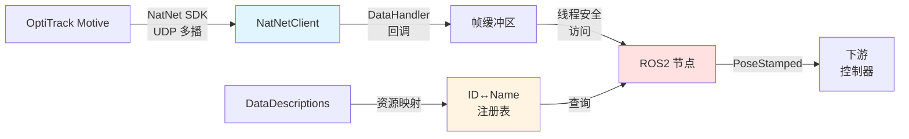

# OptiTrack Motive ROS2 数据流节点

[English Version](./README.md)

## 项目概述

`motive_streamer` 是一个 ROS2 节点，通过 NatNet SDK 与 OptiTrack Motive 动作捕捉系统交互。它提供实时 6DoF（6 自由度）刚体位姿数据，服务于需要高精度反馈的机器人应用，例如自主导航、机械臂操作和视觉伺服控制。

**核心特性**：
- **实时流式传输**：通过 NatNet SDK 回调异步获取数据
- **动态资源映射**：从 DataDescriptions 自动解析刚体 ID ↔ 名称
- **多线程回调**：静态回调函数桥接到 ROS2 发布器
- **网络配置**：支持 UDP 多播流式传输
- **标准 ROS2 接口**：发布 `geometry_msgs/PoseStamped` 消息，无缝集成

---

## 技术栈

| 组件 | 版本/标准 |
|------|----------|
| **编程语言** | C++17 |
| **ROS2 发行版** | Humble Hawksbill |
| **NatNet SDK** | 4.x（已包含） |
| **构建系统** | CMake 3.20+ |
| **通信协议** | UDP Multicast（默认：239.255.42.99） |
| **消息接口** | geometry_msgs, std_msgs |

---

## 系统架构

### 数据流图



### 模块分解

```
MotiveStreamer 节点
├── NatNetClient（SDK 层）
│   ├── 连接管理 (ConnectClient)
│   ├── 数据回调 (DataHandler)
│   └── 消息日志 (MessageHandler)
├── 数据映射 (UpdateDataDescriptions)
│   ├── assetIDtoAssetName (ID → 名称)
│   ├── assetNameToAssetID (名称 → ID)
│   └── assetIDtoAssetDescOrder (ID → 索引)
└── ROS2 发布器
    └── PoseStamped @ /{namespace}/{pose_pub_topic}
```

---

## 关键挑战与解决方案

### 1. **异步回调 → 同步发布**

**挑战**：NatNet SDK 使用网络线程触发的 C 风格回调函数 (`DataHandler`)，而 ROS2 期望在主线程上下文中同步发布消息。

**解决方案**：
- 使用静态回调函数，通过 `void* pUserData` 传递 `MotiveStreamer` 实例
- 在回调内部直接发布（单刚体场景可接受）
- 使用 `rclcpp::Clock().now()` 分配时间戳，保持时序一致性

```cpp
// 线程安全的回调桥接
void NATNET_CALLCONV MotiveStreamer::DataHandler(sFrameOfMocapData* data, void* pUserData) {
    MotiveStreamer* pStreamer = (MotiveStreamer*)pUserData;
    // ... 提取位姿数据 ...
    pStreamer->pubRigidPose->publish(poseStampedMsg);
}
```

**权衡分析**：
- ✅ 零拷贝：无需缓冲，立即发布
- ⚠️ 阻塞风险：若 ROS2 发布阻塞，可能影响 NatNet 线程
- 🔧 未来改进：使用无锁队列支持多刚体场景

---

### 2. **动态 ID ↔ 名称映射**

**挑战**：OptiTrack 为刚体分配数字 ID，但用户通过名称引用（如 "uav1"）。映射关系动态生成，需从 `DataDescriptions` 运行时获取。

**解决方案**：
- 初始化时调用 `GetDataDescriptionList()` 获取所有资源
- 解析 `sDataDescriptions` 结构体，构建双向映射表：
  - `assetNameToAssetID`：用于启动参数 → 内部 ID 查找
  - `assetIDtoAssetName`：用于日志与调试
- 支持多种资源类型（RigidBody、Skeleton、ForcePlate、Device、Asset）

```cpp
void MotiveStreamer::UpdateDataToDescriptionMaps(sDataDescriptions* pDataDefs) {
    for (int i = 0; i < pDataDefs->nDataDescriptions; i++) {
        switch (pDataDefs->arrDataDescriptions[i].type) {
            case Descriptor_RigidBody:
                assetID = pRB->ID;
                assetName = std::string(pRB->szName);
                // ... 插入映射表 ...
        }
    }
}
```

**失败模式**：若刚体名称在 Motive 场景中不存在，启动时抛出异常：
```
RCLCPP_ERROR: No rigid body named uav1
```

---

### 3. **网络中断处理**

**挑战**：OptiTrack 系统可能重启、网络可能断开，或 Motive 应用可能重新加载场景。

**当前实现**：
- `ConnectClient()` 在 `Connect()` 前调用 `Disconnect()`，实现干净重连
- 无自动重试循环（需手动重启节点）

**推荐增强方案**（尚未实现）：
```cpp
// 在构造函数或定时器回调中添加
timer_ = create_wall_timer(5s, [this]() {
    if (!natnetClient->IsConnected()) {
        RCLCPP_WARN(get_logger(), "连接丢失，尝试重连...");
        ConnectClient();
        UpdateDataDescriptions();
    }
});
```

---

### 4. **多线程数据竞争**

**观察到的问题**：`DataHandler` 运行在 NatNet 的网络线程，而 ROS2 发布器可能在节点析构时被主线程访问。

**当前缓解措施**：
- 单发布器实例减少竞争面
- 析构函数在删除 `natnetClient` 前调用 `Disconnect()`

**潜在风险**：
- 若追踪多刚体并存储于共享容器中，需显式互斥锁：
```cpp
std::mutex data_mutex_;
std::lock_guard<std::mutex> lock(data_mutex_);  // 在回调中
```

---

### 5. **Frame ID 配置**

**当前实现**：frame ID 在回调中硬编码为 "base_link"：

```cpp
poseStampedMsg.header.frame_id = "base_link";
```

**限制**：应该参数化以允许不同机器人配置的灵活坐标系分配。

**推荐增强方案**：
```cpp
// 在构造函数中添加
declare_parameter("frame_id", "optitrack_frame");
frame_id_ = get_parameter("frame_id").as_string();

// 在回调中使用
poseStampedMsg.header.frame_id = pStreamer->frame_id_;
```

---

## 安装

### 前置条件

**硬件**：
- OptiTrack 动作捕捉系统（Prime/Flex/Slim 系列）
- 专用千兆以太网网卡（推荐）
- x86_64 Linux 系统

**软件**：
- Ubuntu 22.04 LTS
- ROS2 Humble（desktop-full 安装）
- CMake ≥ 3.20
- GCC ≥ 9.0（支持 C++17）

### 构建步骤

1. **克隆仓库到 ROS2 工作空间**：
```bash
mkdir -p ~/ros2_ws/src
cd ~/ros2_ws/src
git clone <仓库地址> motive_streamer
```

2. **安装 ROS2 依赖**：
```bash
cd ~/ros2_ws
rosdep install --from-paths src --ignore-src -r -y
```

3. **构建功能包**：
```bash
colcon build --packages-select motive_streamer --cmake-args -DCMAKE_BUILD_TYPE=Release
source install/setup.bash
```

4. **验证 NatNet 库链接**：
```bash
ldd install/motive_streamer/lib/motive_streamer/motive_streamer_node | grep NatNet
# 期望输出：libNatNet.so => <工作空间>/install/lib/libNatNet.so
```

---

## 配置与使用

### 网络配置

**1. 检查 OptiTrack 网络设置**（在 Motive 中）：
- View → Data Streaming Pane
- 启用 "Broadcast Frame Data"
- 记录 "Local Interface" IP（如 192.168.50.203）
- 默认端口：Command=1510, Data=1511

**2. 配置 Linux 主机网络**：
```bash
# 设置与 OptiTrack 同网段的静态 IP
sudo ip addr add 192.168.50.208/24 dev eth0

# 启用多播路由（若使用多播模式）
sudo ip route add 224.0.0.0/4 dev eth0

# 测试连通性
ping 192.168.50.203
```

**3. 验证多播接收**（可选）：
```bash
# 安装 iperf3
sudo apt install iperf3

# 监听多播组（从另一终端）
iperf3 -s -B 239.255.42.99

# 使用 tcpdump 检查数据包到达
sudo tcpdump -i eth0 host 239.255.42.99
```

---

### 启动参数

| 参数名 | 类型 | 默认值 | 描述 |
|--------|-----|--------|------|
| `motive_topic_name` | string | `motive_rigid_body_list` | （未使用）完整刚体列表话题名 |
| `local_address` | string | `192.168.50.208` | 本机 IP 地址 |
| `motive_address` | string | `192.168.50.203` | OptiTrack 服务器 IP 地址 |
| `pose_pub_topic` | string | `vision_pose/pose` | 位姿发布话题名 |
| `rigid_name` | string | `uav1` | 刚体名称（在 Motive 中定义） |
| `namespace` | string | （与 `rigid_name` 相同） | ROS2 命名空间，用于话题隔离 |

### 启动命令

**单刚体追踪**：
```bash
ros2 launch motive_streamer motive_streamer.py \
    local_address:=192.168.50.208 \
    motive_address:=192.168.50.203 \
    rigid_name:=uav1 \
    pose_pub_topic:=vision_pose/pose
```

**预期输出**：
```
[INFO] [motive_streamer]: NatNet SDK Version: 4.1.0.0
[INFO] [motive_streamer]: Client initialized and ready.
[INFO] [motive_streamer]: Client is connected to server and listening for data...
[INFO] [motive_streamer]: rigid_name: uav1, rigid_id: 1
[INFO] [motive_streamer]: time_span: 0.000152
```

**验证数据流**：
```bash
# 检查话题发布频率
ros2 topic hz /uav1/vision_pose/pose

# 查看实时数据
ros2 topic echo /uav1/vision_pose/pose

# 查看消息结构
ros2 interface show geometry_msgs/msg/PoseStamped
```

---

## 消息定义

### 发布话题

| 话题名 | 类型 | 频率 | 描述 |
|--------|-----|------|------|
| `/{namespace}/{pose_pub_topic}` | `geometry_msgs/PoseStamped` | 120 Hz | 目标刚体 6DoF 位姿 |

### 自定义消息

**MotiveRigidBody.msg**：
```msg
int32 id          # Motive 中的刚体 ID
bool valid        # 追踪状态（遮挡时为 false）
geometry_msgs/Pose pose  # 6DoF 位姿（位置 + 四元数姿态）
```

**MotiveRigidBodyList.msg**：
```msg
std_msgs/Header header
motive_streamer/MotiveRigidBody[] rigid_bodies
```

*（注意：`MotiveRigidBodyList` 已定义但当前未发布。未来扩展用于多刚体追踪。）*

---

## 失败模式与错误处理

### 常见错误

| 错误信息 | 原因 | 解决方法 |
|---------|------|---------|
| `Unable to connect to server. Error code: -1` | 网络不可达或 IP 错误 | 验证 `motive_address`，检查防火墙，ping 服务器 |
| `No rigid body named <name>` | 刚体在 Motive 场景中不存在 | 检查 Motive 中的刚体名称，确保标记为 "Rigid Body" |
| `Unable to retrieve Data Descriptions` | Motive 未开启数据流 | 在 Motive Data Streaming 面板启用 "Broadcast Frame Data" |
| `Connection lost mid-session` | 网线拔出或 Motive 崩溃 | 需手动重启（暂无自动重连） |
| 数据流静默（无位姿更新） | 刚体 ID 错误或追踪丢失 | 检查日志中的 `rigid_id`，验证 Motive 中标记点可见 |

### 调试命令

```bash
# 检查节点是否运行
ros2 node list | grep motive_streamer

# 查看所有参数
ros2 param list /motive_streamer

# 监控回调执行时间
ros2 topic echo /rosout | grep time_span

# 在操作系统层面测试网络连通性
sudo tcpdump -i eth0 udp port 1511 -c 10
```

---

## 代码结构

### 关键文件

| 文件 | 行数 | 职责 |
|------|------|------|
| `include/motive_streamer/motive_streamer.hpp` | 54 | 类声明，成员变量 |
| `src/motive_streamer.cpp` | 249 | 核心逻辑：连接、映射、回调 |
| `src/motive_streamer_main.cpp` | 22 | 入口点，ROS2 初始化 |
| `msg/MotiveRigidBody.msg` | 3 | 单刚体自定义消息 |
| `msg/MotiveRigidBodyList.msg` | 2 | 多刚体自定义消息 |
| `launch/motive_streamer.py` | 37 | 启动文件与参数声明 |
| `config/stream_rigid.yaml` | 5 | 默认配置参数 |
| `CMakeLists.txt` | 85 | 构建配置与 NatNet 链接 |

### 关键代码段

**连接初始化** (`motive_streamer.cpp:134-144`)：
```cpp
int MotiveStreamer::ConnectClient() {
    natnetClient->Disconnect();  // 重连前清理断开
    int ret = natnetClient->Connect(connectParams);
    if (ret != ErrorCode_OK) {
        RCLCPP_ERROR(get_logger(), "Unable to connect to server. Error code: %d", ret);
        return ErrorCode_Internal;
    }
    return ret;
}
```

**数据描述符解析** (`motive_streamer.cpp:161-248`)：
- 处理 7 种描述符类型：RigidBody、Skeleton、MarkerSet、ForcePlate、Device、Camera、Asset
- 构建三个映射表用于双向查找和排序
- 检测重复 ID 并记录警告

**帧回调** (`motive_streamer.cpp:80-110`)：
- 包含时间测量代码以记录处理时间（每帧都记录日志）
- 遍历帧中所有刚体以查找目标 ID
- 直接发布 OptiTrack 坐标系（Y-up，右手系）；到 ROS 坐标系的转换可通过 TF 在下游处理

---

## 性能优化说明

### 设计决策

1. **回调中直接发布**：实现在 `DataHandler` 中直接发布，无中间缓冲。这最小化延迟但将 NatNet 网络线程与 ROS2 发布器耦合。

2. **高效数据结构**：使用 `std::map` 进行 ID↔Name 解析，查找复杂度为 `O(log n)`。

3. **线性刚体搜索**：当前实现遍历 `data->RigidBodies[]` 数组查找目标 ID。对于少量追踪刚体可接受，但大量刚体时可能成为瓶颈。

4. **时间戳生成**：使用 `rclcpp::Clock().now()` 在回调中生成时间戳。替代方案是使用 `data->fTimestamp`（如果时钟已同步）。

5. **热路径日志**：回调在每帧都记录处理时间，可能影响性能。考虑在生产环境中禁用或使用条件编译。

---

## 依赖项

### 运行时依赖
- `rclcpp`：ROS2 C++ 客户端库
- `geometry_msgs`：ROS2 标准几何消息
- `std_msgs`：ROS2 标准消息原语
- `libNatNet.so`：NatNet SDK 共享库（已打包）

### 构建依赖
- `ament_cmake`：ROS2 构建系统
- `rosidl_default_generators`：消息生成工具

### 外部库
NatNet SDK（v4.x）包含在 `natnet/` 目录中：
```
natnet/
├── include/          # SDK 头文件
│   ├── NatNetClient.h
│   ├── NatNetTypes.h
│   └── ...
└── lib/
    └── libNatNet.so  # x86_64 Linux 预编译版本
```

---

## 验证与测试

### 功能测试检查清单
- [ ] 节点无错误启动，日志显示 SDK 版本
- [ ] 刚体 ID 从名称正确解析
- [ ] 位姿数据在配置的话题上发布
- [ ] 连接参数与 Motive 流式传输设置匹配
- [ ] 坐标值与 Motive 视口一致
- [ ] 四元数有效（检查 NaN 或非法值）

### 网络验证
```bash
# 测试 1：验证多播组成员
netstat -g | grep 239.255.42.99

# 测试 2：监控 UDP 数据包接收
sudo tcpdump -i eth0 -n udp port 1511 -c 5

# 测试 3：检查 ROS2 话题发布
ros2 topic hz /uav1/vision_pose/pose --window 100
ros2 topic echo /uav1/vision_pose/pose
```

### 数据录制
```bash
# 录制位姿数据用于分析
ros2 bag record /uav1/vision_pose/pose --duration 10

# 分析录制数据
ros2 bag info <bag 文件>
ros2 bag play <bag 文件>
```

---

## 已知限制

1. **单刚体追踪**：当前实现每个节点实例追踪一个刚体（虽然 `MotiveRigidBodyList` 消息已定义用于未来多刚体支持）
2. **无自动重连**：连接丢失需手动重启（无基于定时器的重连逻辑）
3. **固定 Frame ID**：`frame_id` 在 `motive_streamer.cpp` 第 90 行硬编码为 "base_link"
4. **仅配置多播模式**：连接硬编码为 `ConnectionType_Multicast`（第 29、32 行）
5. **无追踪质量指标**：SDK 在 `sRigidBodyData` 中提供的追踪质量标志未在发布消息中暴露
6. **冗余日志**：每帧都记录处理时间，可能影响生产环境性能
7. **未使用参数**：`motive_topic_name` 参数已声明但从未使用

---

## 故障排除

### 问题：连接失败

**症状**： 
```
[ERROR] [motive_streamer]: Unable to connect to server. Error code: -1. Exiting.
```

**诊断**：
```bash
# 测试网络连通性
ping <motive_address>

# 检查 Motive 是否正在流式传输
# 在 Motive 中：View → Data Streaming Pane → "Broadcast Frame Data" 应该启用

# 验证多播路由
ip route | grep 224.0.0.0
```

**解决方案**：
- 验证 `local_address` 和 `motive_address` 参数与网络配置匹配
- 检查防火墙设置（允许 UDP 端口 1510、1511）
- 确保网络接口支持多播

---

### 问题：刚体未找到

**症状**：
```
[ERROR] [motive_streamer]: No rigid body named uav1
```

**解决方案**：
- 打开 Motive 并验证刚体名称与 `rigid_name` 参数完全匹配（区分大小写）
- 检查该资源在 Motive 中标记为 "Rigid Body"（不仅是标记点集）
- 确保 `UpdateDataDescriptions()` 成功（检查是否有警告消息）

---

## 代码实现细节

### 线程安全分析

**当前实现**：
```cpp
// DataHandler 在 NatNet 网络线程中执行（非 ROS2 主线程）
void NATNET_CALLCONV MotiveStreamer::DataHandler(sFrameOfMocapData* data, void* pUserData) {
    MotiveStreamer* pStreamer = (MotiveStreamer*)pUserData;
    pStreamer->pubRigidPose->publish(poseStampedMsg);  // 跨线程访问发布器
}
```

**安全性考量**：
- `rclcpp::Publisher::publish()` 在 ROS2 文档中标记为线程安全
- 当前单发布器设计最小化共享状态
- 若扩展为在回调中访问成员容器（maps），需添加互斥锁保护

---

### 内存管理

**资源生命周期**（来自析构函数）：
```cpp
MotiveStreamer::~MotiveStreamer() {
    if (natnetClient) {
        natnetClient->Disconnect();  // 清理前先停止网络线程
        delete natnetClient;
        natnetClient = nullptr;
    }
    if (dataDefs) {
        NatNet_FreeDescriptions(dataDefs);  // SDK 提供的清理函数
        dataDefs = nullptr;
    }
}
```

**关键点**：
- 在删除客户端前断开连接以防止 use-after-free
- 使用 SDK 的 `NatNet_FreeDescriptions()` 进行正确清理
- `UpdateDataDescriptions()` 在获取新描述符前清除旧描述符

---

## 贡献指南

本项目为研究/作品集项目。如需报告问题或提出改进建议，请联系维护者。

---

## 许可证

TODO: 指定许可证（如 MIT、Apache 2.0、BSD-3-Clause）

**注意**：NatNet SDK 为 NaturalPoint Inc. 专有软件。SDK 许可条款见 [OptiTrack EULA](https://www.optitrack.com/about/legal/eula.html)。

---

## 参考资料

- [NatNet SDK 文档](https://docs.optitrack.com/developer-tools/natnet-sdk)
- [OptiTrack 支持下载](https://www.optitrack.com/support/downloads/developer-tools.html)
- [ROS2 Humble 文档](https://docs.ros.org/en/humble/index.html)
- [geometry_msgs/PoseStamped](https://docs.ros2.org/latest/api/geometry_msgs/msg/PoseStamped.html)
- [ROS REP-103: Standard Units of Measure and Coordinate Conventions](https://www.ros.org/reps/rep-0103.html)

---

## 致谢

感谢 OptiTrack 提供 NatNet SDK 以及 ROS2 社区提供的优秀工具链。

---

## 作者

**维护者**：chentingjia (chentingjia1209@163.com)

**项目目的**：为自主无人机控制与机器人操作研究提供高精度位姿反馈。

**最后更新**：2026-03
